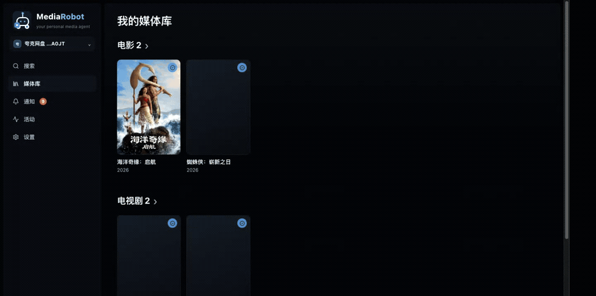

<p align="center">
  <picture>
    <source media="(prefers-color-scheme: dark)" srcset="docs/images/hero-dark.svg">
    
  </picture>
</p>

<p align="center">
  <a href="https://github.com/CodeByZack/mediary-scout/actions/workflows/ci.yml"></a>
  <a href="https://github.com/CodeByZack/mediary-scout/releases"></a>
  <a href="LICENSE"></a>
  
</p>

# MediaRobot

**自己部署的个人媒体库助手。**

告诉它你想找什么，它负责搜索资源、转存到你的网盘，并检查文件是否真的已经落盘。电视剧还可以继续追踪。哪一季缺了哪几集，它会记录下来，之后的定时巡检只处理还没补齐的部分。

不需要把视频下载到本地，也没有托管服务。MediaRobot 运行在你自己的 NAS 或服务器上，网盘、TMDB 和 LLM 都使用你自己的账号和配置。

<p align="center">
  
</p>

<p align="center">
  <sub>首页最近热门 → 打开影片 → 点击「获取」→ 转存完成 → 验证入库</sub>
</p>

---

## 它能做什么

### 搜索并转存

输入电影或电视剧名称，MediaRobot 会根据 TMDB 信息找到对应作品，再搜索可用资源。

找到合适的资源后，直接转存到你配置的网盘，不需要先下载到本地。

### 检查是否真的入库

转存完成并不代表文件一定已经准备好。

MediaRobot 会再次读取网盘中的实际目录和文件，对照预期结果进行检查。确认文件已经落盘后，才会把它标记为已入库。

### 自动追剧

电视剧会记录每一季的集数情况。

例如：

```text
S01  10 / 10
S02   8 / 10
S03  10 / 10
```

后续巡检时，只需要处理 S02 缺少的两集，而不是重新搜索整部剧。

### 多个网盘

可以配置多块网盘作为媒体库。

不同网盘之间可以独立使用，侧栏可以随时切换当前工作区。

---

## 安装

### 飞牛 fnOS

如果你使用飞牛 fnOS，可以直接安装原生应用。

从 [Releases](https://github.com/CodeByZack/mediary-scout/releases/latest) 下载对应架构的 `.fpk`：

```text
mediary-scout-arm.fpk
mediary-scout-x86.fpk
```

然后在 fnOS 应用中心选择 **手动安装**。

### Docker Compose

任何可以运行 Docker 的常开设备都可以使用。

```bash
git clone https://github.com/CodeByZack/mediary-scout
cd mediary-scout

cp .env.example .env

docker compose \
  --project-directory . \
  -f deploy/docker/docker-compose.yml \
  up -d
```

启动后打开：

```text
http://<主机>:3000
```

---

## 第一次使用

基本只需要配置三样东西：

**TMDB → LLM → 网盘**

### 1. TMDB

MediaRobot 使用 TMDB 获取影片和剧集的基础信息，包括：

- 片名
- 季数和集数
- 上映状态
- 海报和元数据

TMDB API 是必需配置。

申请和配置方式见：

[docs/tmdb-setup.md](docs/tmdb-setup.md)

配置位置：

**设置 → 资源与服务**

### 2. LLM

部分资源名称并不能直接判断对应的是哪一部作品，例如：

- 同名电影
- 多季打包资源
- 简繁混杂
- 年份不同的同名作品

MediaRobot 使用 LLM 辅助判断这些情况。

支持 **OpenAI 兼容 API**，只需要填写 Endpoint 和 API Key，然后点击「测试连接」。

配置位置：

**设置 → 资源与服务 → LLM**

### 3. 网盘

选择一个网盘作为媒体库。

目前支持多个网盘，可以同时配置多个工作区。

---

## 使用流程

配置完成之后，日常使用基本就是：

```text
搜索片名
   ↓
选择作品
   ↓
点击「获取」
   ↓
搜索资源
   ↓
检查目标目录
   ↓
转存到网盘
   ↓
检查实际落盘结果
   ↓
加入媒体库
```

整个过程可以在 **活动页** 查看。

每个任务都会记录处理过程，遇到失败时可以直接查看具体步骤。

### 媒体库

媒体库按照电影、电视剧等类型整理。

电视剧会显示当前状态：

- 已入库
- 有缺集
- 追更中

进入详情页可以查看每一季的覆盖情况以及缺少的集数。

### 定时巡检

可以在：

**设置 → 巡检与通知**

配置每天的巡检时间，也可以设置多个时间点。

巡检只会处理当前仍然存在缺口的内容。

每次巡检结束后，结果会出现在 **通知页**，包括：

- 本次新增了哪些集
- 哪些内容仍然缺失
- 本次巡检是否有失败任务

---

## 技术栈

MediaRobot 是一个单体应用，目前没有额外的消息队列或独立 worker 服务。

```text
Next.js 16
React 19
TypeScript
SQLite (node:sqlite)
TMDB
Vitest
```

使用 Next.js App Router / Turbopack。

Web、后台任务和定时巡检运行在同一个进程中。

常用开发命令：

```bash
npm run dev:web      # 开发
npm test             # 单元测试
npm run typecheck    # 类型检查
npm run lint         # ESLint
npm run build:web    # 生产构建
```

---

## 项目来源

MediaRobot fork 自 [`fancydirty/clawd-media-track`](https://github.com/fancydirty/clawd-media-track)。

原项目是一个基于 agent skill 的媒体获取与追踪工具，主要面向 115 网盘。

这个项目保留了原项目中比较核心的资源获取和追踪思路，但目前已经做了比较大的改动，包括：

- 全新的 Web UI
- 多网盘支持
- 配置中心
- 媒体库
- 自动巡检
- Docker Compose 部署
- fnOS 原生应用
- 转存后的实际文件验证

所以它现在已经不是原项目的简单 UI 包装，而是一个独立维护的项目。

感谢原项目提供的思路和基础。

---

## 致谢

- [`fancydirty/clawd-media-track`](https://github.com/fancydirty/clawd-media-track) —— 项目来源
- [PanSou](https://github.com/fish2018/pansou-web) —— 资源搜索后端
- [Prowlarr](https://github.com/Prowlarr/Prowlarr) —— 索引器管理
- [p115client](https://github.com/ChenyangGao/p115client) —— 115 API 参考
- [AList](https://github.com/AlistGo/alist) —— 光鸭云盘 API 接入参考
- [p123client](https://github.com/ChenyangGao/p123client) —— 123 网盘 API 参考
- [cloud189-auto-save](https://github.com/1307super/cloud189-auto-save) / [cloudpan189-api](https://github.com/tickstep/cloudpan189-api) —— 天翼云盘 API 参考
- [TMDB](https://www.themoviedb.org/) —— 媒体元数据

MediaRobot 与 115、夸克、光鸭云盘、123 网盘、天翼云盘、TMDB 以及任何资源索引器均无隶属关系。

---

## 许可证

[0BSD](LICENSE)。

MediaRobot 是开源、自部署软件，不提供托管服务。

你需要自行提供：

- NAS / 服务器
- 网盘账号
- TMDB API Key
- LLM API
- 其他第三方服务的账号或凭证
