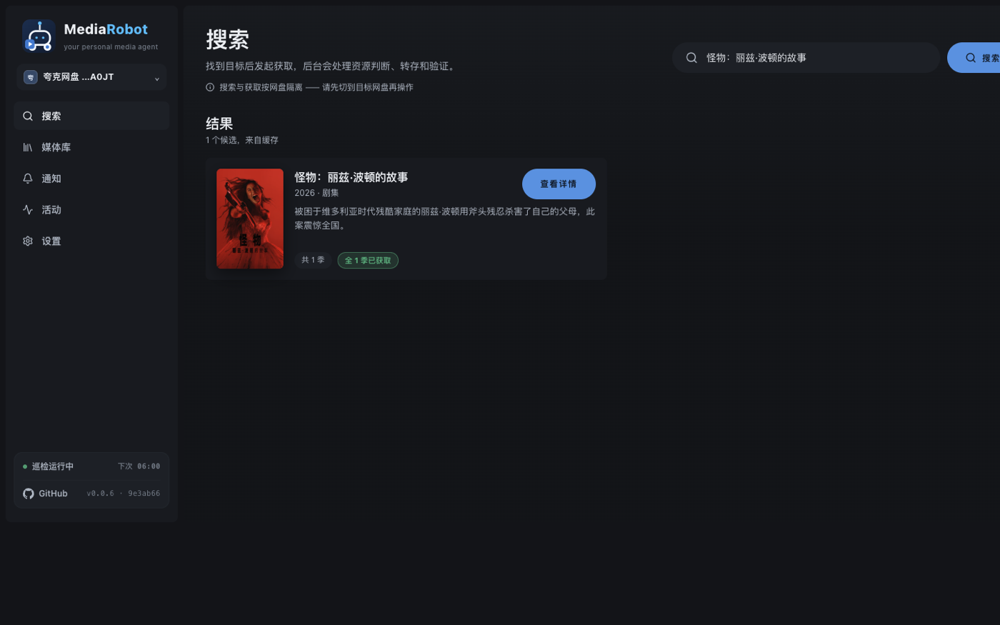
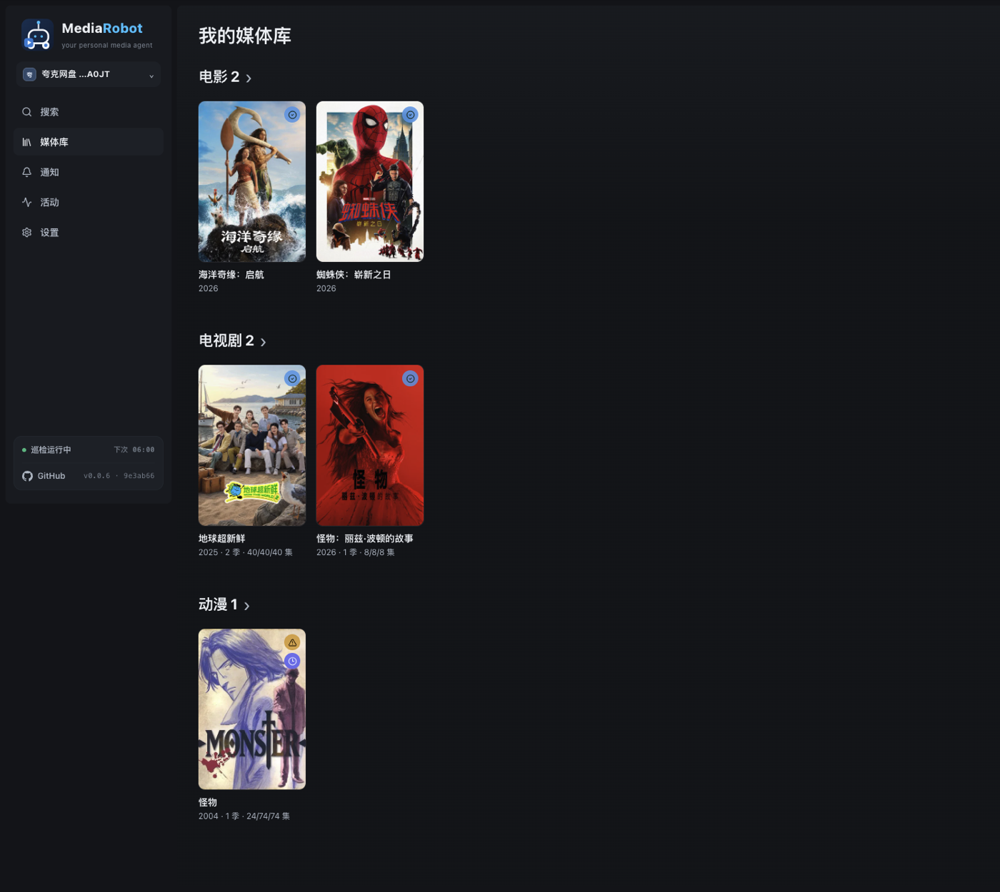
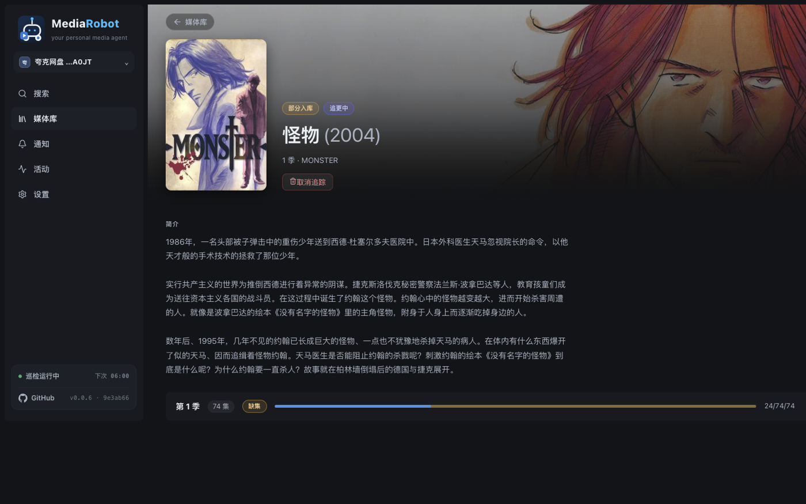
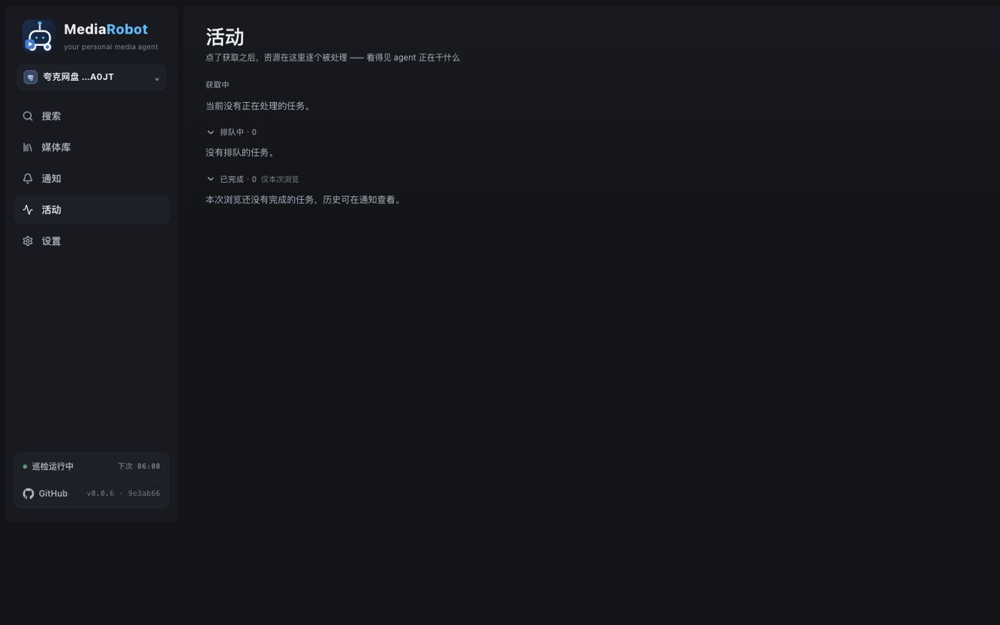
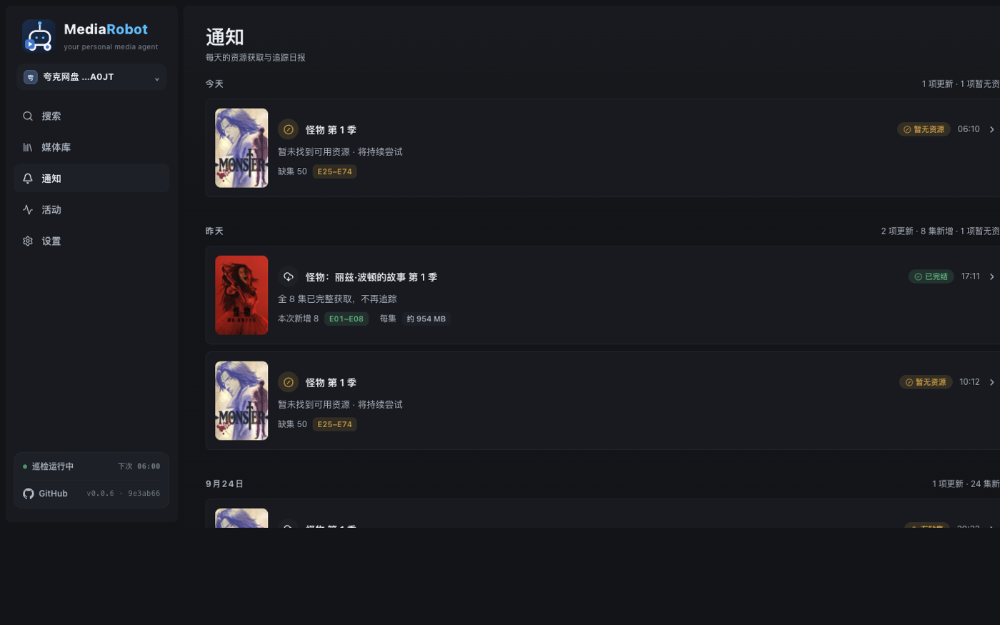
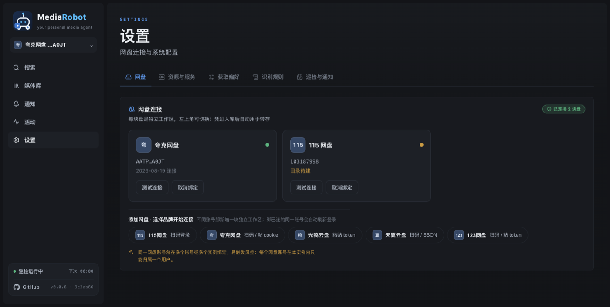
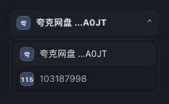
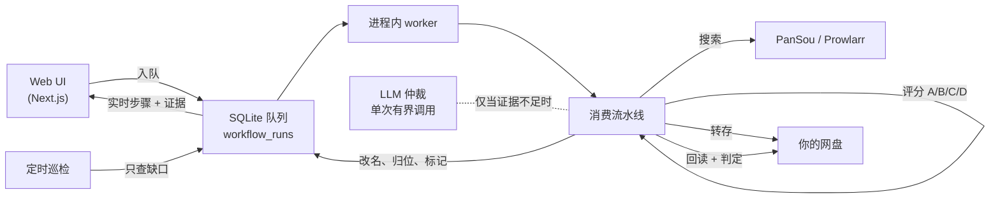

<p align="center">
  
</p>

<p align="center">
  <b>给你自己网盘用的媒体获取与追踪 agent。</b>
</p>

<p align="center">
  <a href="https://github.com/CodeByZack/mediary-scout/actions/workflows/ci.yml"></a>
  <a href="https://github.com/CodeByZack/mediary-scout/releases"></a>
  <a href="LICENSE"></a>
  
  
  
  
</p>

<p align="center">
  <a href="#快速开始">快速开始</a> ·
  <a href="docs/deploy.md">部署指南</a> ·
  <a href="https://github.com/CodeByZack/mediary-scout/releases/latest">📥 下载</a>
</p>

---

你说要某部电影 / 剧 / 番,MediaRobot 跨资源源(PanSou / Prowlarr)检索,把最合适的**转存进你自己的 夸克 / 115 / 光鸭 / 123 / 天翼 网盘**,转存后回读验证、按 TMDB 规范命名归位,并持续追踪还缺哪些集。

**确定性代码拥有每一步的执行与校验**;LLM 只在真正需要判断的节点做**有界的单次仲裁**(选片、诊断、集数映射),解析失败一律保守降级 —— 一次干净的获取通常只花 2 次 AI 调用,顺利时为零。


> **免责声明。** MediaRobot 是**开源、自部署**软件,**不提供、也永远不会提供托管服务** —— 你自己跑实例、自带网盘 / LLM / 元数据凭证。它做的就是你本可以在自己网盘里手动完成的那些文件操作。项目定位详见 [docs/distribution-and-legal-positioning.md](docs/distribution-and-legal-positioning.md)。

## 目录

- [它是什么](#它是什么)
- [界面](#界面)
- [快速开始](#快速开始)
- [支持的网盘](#支持的网盘)
- [一次任务怎么跑](#一次任务怎么跑)
- [Agent API](#agent-api让-ai-agent-替你操作)
- [部署](#部署)
- [状态与限制](#状态与限制)
- [技术栈](#技术栈)
- [致谢](#致谢)

## 它是什么

大多数「媒体自动化」要么搜得好但不知道你到底缺哪集,要么会搬文件却从不验证落了什么。MediaRobot 把获取当成一个**状态问题**,凭证据行动:

- **多盘、品牌可扩展** —— 现支持夸克、115、光鸭(GuangYaPan)、123、天翼五块盘,每块盘都是一等工作区(树模型:一个账号、多块盘),侧栏一键切换。接入新品牌是个收敛的插件活。
- **确定性优先** —— 候选资源先过机械评分(A/B/C/D:标题 / 别名匹配含简繁折叠、季与集数规则、中字标记、死链记忆、同名异作排除)。唯一 A 级候选直接盲转;仅当证据确实需要判断时才咨询 LLM,且永远是**单次有界**调用。
- **先验证,再入库** —— 每次转存都回读网盘真实落盘结果做判定(覆盖了吗?脏包吗?超季吗?),通过才规范改名(`Title.SxxExx`)、归位、标记已获取。失败**如实报告「暂无资源」并继续尝试**,绝不伪造成功。
- **追踪 + 定时补缺** —— 季级状态机;你可以在设置里指定每日巡检时间点,它只回来处理仍有缺集的剧,一季失败不阻塞其它季。
- **网盘原生** —— 直接把分享 / 磁力**转存**(秒传 / save)进你的网盘,**不往本地磁盘下载**。

面向熟悉自己网盘账号与凭证的进阶自部署用户 —— 不是一键式消费产品。

## 界面

| | |
|---|---|
| **搜索 → 获取** —— 找到目标、点「获取」,流水线接管 |  |
| **媒体库墙** —— 按类型分架,每张海报带入库 / 缺集 / 追更徽章 |  |
| **详情页** —— 海报、别名、各季覆盖与缺口、追踪状态 |  |
| **活动队列** —— 获取中 → 排队中 → 已完成,看得见 agent 正在干什么(图为空闲态) |  |
| **通知** —— 每次巡检的逐部结果:新增了哪几集、还缺哪些、每集约多大 |  |
| **设置** —— 网盘 / 资源源 / 偏好 / 识别规则 / 巡检,五个分区 |  |

多块盘就是一个工作区切换器,各自带品牌标识:



### 设置里能调什么

| 分区 | 内容 |
|---|---|
| **网盘** | 115 / 夸克 / 123 / 天翼扫码登录(或粘 cookie / token)、光鸭粘 token;每块盘可测试连接、解绑 |
| **资源与服务** | **PanSou**(内置默认实例,可换自己的地址)、**Prowlarr**(可选,加你的索引器拿磁力 / 种子源)、**外挂中文字幕**(assrt.net 免费;仅对非国产内容生效,且需网盘支持外链离线落盘 —— 目前 **115 / 光鸭**,夸克暂不触发) |
| **获取偏好** | 偏好语言(影响起名与字幕)、偏好画质(作为选片优先级传给 AI,**不进搜索关键词**) |
| **识别规则** | 用正则解析文件名里的季号 / 集号。内置规则**只读且恒在**,自定义规则追加在后;自带规则测试台,粘一个文件名就能看解析结果。同区还有 **Prompt 覆盖**(改 AI 仲裁升级点的提示词,留空即内置) |
| **巡检与通知** | 每日定时巡检时间点(可多个)、立即巡检按钮、上次 / 下次巡检时间 |

**多用户**:设 `MEDIA_TRACK_MULTI_USER=1` 后出现注册 / 登录页,每人各绑各的盘、各看各的库。即便开了多用户,也仍建议放在 Tailscale / Access 之后。

## 快速开始

### 飞牛 fnOS 原生应用(NAS 首选)

去 [Releases](https://github.com/CodeByZack/mediary-scout/releases/latest) 下载对应架构的 `.fpk`(`mediary-scout-arm.fpk` / `mediary-scout-x86.fpk`),在 fnOS 应用中心「手动安装」即可。应用跑在 **3333** 端口,数据由 fnOS 应用目录持久化 —— 不装 Docker、不开终端。打包细节:**[deploy/fpk/README.md](deploy/fpk/README.md)**。

### Docker Compose(任何常开主机)

```bash
git clone https://github.com/CodeByZack/mediary-scout && cd mediary-scout
cp .env.example .env   # 可选——大多数配置可在 UI 里填
docker compose --project-directory . -f deploy/docker/docker-compose.yml up -d   # web + 自带 PanSou + SQLite 卷
```

打开 `http://<主机>:3000`,在**设置**里按需填写(全部可选):

- **网盘** —— 115 / 夸克 / 123 / 天翼扫码,光鸭粘 token([连接教程](docs/deploy.md#光鸭云盘guangyapan连接))。凭证入库后自动用于转存。
- **TMDB** —— 开箱即用;想用自己的额度可在设置填 key([申请步骤](docs/tmdb-setup.md))。
- **LLM** —— 任意 OpenAI 兼容端点(`baseURL` / `apiKey` / `modelId`),设置页可一键测试连通性。你的 key 只留在你自己的实例。
- **Prowlarr**(可选) —— 加索引器拿磁力 / 种子源。注意:**夸克无磁力 API,故 Prowlarr 只对 115 / 光鸭这类支持磁力的盘有意义**。

> 🇨🇳 **国内 Docker Hub 不稳定?** 首次构建报 `auth.docker.io ... i/o timeout` = 需要镜像加速,在 `.env` 加 `DOCKER_MIRROR=docker.1ms.run` 再 `up`。详见 **[docs/deploy.md → 国内构建加速](docs/deploy.md#国内构建加速docker-hub-常年不稳定)**。

完整部署向导(含 Tailscale、多用户、升级):**[docs/deploy.md](docs/deploy.md)**。

## 支持的网盘

五个国内网盘品牌,每块盘都是一等工作区(按可消费 PanSou 资源量排序;115 与 123 是**双路径**:自有分享链 + 磁力):

| 盘 | 标识 | 转存方式 | 登录方式 | 备注 |
|---|---|---|---|---|
| **夸克** | `quark` | 分享链(无磁力 web API) | 扫码 / 粘 cookie | PanSou 上分享池最大 |
| **123网盘** | `pan123` | 分享链 **+** 原生离线下载 | 扫码(约 90 天) / 粘 token | 与 115 同为双路径;**免费账号可转存** |
| **115** | `pan115` | 分享链 **+** 磁力(内置离线,亦可用 Prowlarr) | 扫码 / 粘 cookie | 完整支持,**支持字幕文件一并转存** |
| **光鸭云盘** | `guangya` | **仅磁力 / 离线下载**(不转分享链) | 粘 token | 迅雷系;与 Prowlarr 搭配最好;支持字幕转存 |
| **天翼云盘** | `tianyi` | 分享链 | 扫码 / 粘 SSON cookie | PanSou 上分享池目前最小 |

分享量抽样(2026-07 时点样本:6 部热门片 × 一个配好频道的 PanSou 实例,你的频道配置会不同):

| 盘 | 自有分享链 | 可兼收磁力 | 可用池 |
| --- | ---: | ---: | ---: |
| 夸克 | 523 | — | **523** |
| 123 | 120 | 361 | **481** |
| 115 | 100 | 361 | **461** |
| 光鸭 | — | 361 | **361** |
| 天翼 | 63 | — | **63** |

新品牌接入 storage-brand 注册表;大头是为该网盘的转存 API 写一个客户端 + 一个 storage executor。

## 一次任务怎么跑



- **状态在 SQLite**(`MEDIA_TRACK_SQLITE_PATH`)—— 任务可跨重启续跑;流水线从真实网盘 + DB 状态重建,而不是缓存的对话历史。
- 元数据来自 **TMDB**(开箱即用;可在设置里填自己的 key)。
- 每一步都落库(`agent_steps`)—— 活动页展示可展开的逐步骤证据与评分摘要,通知页展示每次巡检的最终结论。

## Agent API(让 AI agent 替你操作)

Web 应用暴露一套**本地 HTTP API**,让任意编码 agent(Claude Code、Codex、opencode 等)不开界面就能操作 MediaRobot:改设置、触发获取、查进度。

首次启动会生成 Bearer token(存在 `app_settings`),请求带 `Authorization: Bearer <token>` 鉴权。

| 方法 | 路径 | 用途 |
|---|---|---|
| `GET` | `/api/agent/config` | 读设置(密钥打码) |
| `PUT` | `/api/agent/config` | 局部更新(拒绝写入打码值 `***`) |
| `POST` | `/api/agent/acquire` | 搜 TMDB → 入队(歧义返回 409) |
| `POST` | `/api/agent/patrol` | 触发一次巡检 |
| `GET` | `/api/agent/library` | 已追踪作品 + 缺集 |
| `GET` | `/api/agent/activity` | 当前队列 + 最近通知 |

全部需要 `Authorization: Bearer <token>`。**未配置 token → `404`(对外不可见)**;token 错误 / 缺失 → `401`。

## 部署

- **fnOS 原生包**:[deploy/fpk/README.md](deploy/fpk/README.md)
- **Docker**:[docs/deploy.md](docs/deploy.md)(含反向代理、Tailscale、多用户、升级与自检)
- **让 AI agent 带你部署**:把这段提示词粘给任意编码 agent ——

````markdown
你在部署 MediaRobot(一个自部署的媒体获取应用)。请遵循仓库的 docs/deploy.md,按顺序问用户下面的问题,再执行。

## 必须先问(没答案不要开工)
1. **部署在哪?** 飞牛 fnOS NAS(原生 .fpk,见 deploy/fpk/README.md),还是任意 Docker 主机(NAS / 软路由 / 闲置 PC / VPS)?你打算怎么操作这台机器 —— SSH 还是它的本地终端?
2. **单用户还是多用户?** 默认单用户(只有你自己)。多用户可以让家人 / 朋友各自注册、各绑各的盘、各看各的库。

## 建议问(有默认值,但确认一下)
3. **只在局域网,还是要外网可达?** 仅局域网(默认)或用 Tailscale(家用推荐;永远不要把端口裸暴露)。
4. **现在就配真实获取,还是先跑起来?** 真实获取需要一块受支持的网盘(夸克 / 115 / 光鸭 / 123 / 天翼)+ 一个 LLM 端点(OpenAI 兼容)。

## 然后执行(Docker 路径)
- `git clone https://github.com/CodeByZack/mediary-scout && cd mediary-scout`
- 中国大陆:首次 `up` 前先在 `.env` 里设 `DOCKER_MIRROR`(见 docs/deploy.md)
- `docker compose --project-directory . -f deploy/docker/docker-compose.yml up -d`(首次构建需几分钟)
- 多用户:在 `.env` 加 `MEDIA_TRACK_MULTI_USER=1`,再 `docker compose --project-directory . -f deploy/docker/docker-compose.yml up -d web`
- 打开 `http://<主机>:3000`,带用户走一遍设置(网盘 / LLM / 可选项)
- 确认服务在跑,把 URL 告诉用户,并说明怎么升级(`git pull && ./deploy/docker/deploy.sh` —— 它会重建、重启,并自检容器确实在跑拉取后的那个提交)
````

## 状态与限制

- 自部署、面向进阶用户;你至少需要一块受支持网盘**可用的转存权限**(115 / 夸克通常需要会员;123 / 天翼免费账号可用)。
- 定时巡检需要**常开主机**才有意义。
- 外挂中文字幕依赖网盘能力:**目前只有 115 与光鸭支持字幕转存**,夸克 / 天翼 / 123 不支持。
- **通知目前是站内的**(通知页 + 侧栏未读徽章),没有内置第三方推送通道。
- 本项目不是托管产品,也不附带任何托管后端。

## 技术栈

- **Next.js 16**(App Router,Turbopack)+ **React 19**,TypeScript strict
- **SQLite**(`node:sqlite`)—— 队列、追踪状态、步骤证据、设置
- 单进程:web + 进程内 worker + 定时巡检,没有额外的消息队列或独立服务
- 测试:**Vitest,200+ 文件 / 2200+ 用例**(纯逻辑集中在 `apps/web/lib/*.ts` 与 `packages/workflow`)

```bash
npm run dev:web      # 开发（web + worker）
npm test             # 单测
npm run typecheck    # 类型检查
npm run lint         # ESLint（0 warning 门槛）
npm run build:web    # 生产构建（CI 必跑）
```

## 致谢

建立在以下项目之上,感谢它们:

- [PanSou](https://github.com/fish2018/pansou-web) —— 资源搜索后端
- [Prowlarr](https://github.com/Prowlarr/Prowlarr) —— 索引器管理(可选)
- [p115client](https://github.com/ChenyangGao/p115client) —— 115 API 参考
- [AList](https://github.com/AlistGo/alist) —— 光鸭云盘 API 接入参考(`drivers/guangyapan`)
- [p123client](https://github.com/ChenyangGao/p123client) —— 123网盘 API 参考
- [cloud189-auto-save](https://github.com/1307super/cloud189-auto-save) / [cloudpan189-api](https://github.com/tickstep/cloudpan189-api) —— 天翼云盘 API 参考
- [assrt.net](https://assrt.net) —— 中文字幕接口
- [TMDB](https://www.themoviedb.org/) —— 元数据(本产品未经 TMDB 认可或认证)

与 115、夸克、光鸭云盘、123网盘、天翼云盘、TMDB 及任何索引器均无隶属关系。MediaRobot 是围绕这些组件构建的独立、克制的工具。
